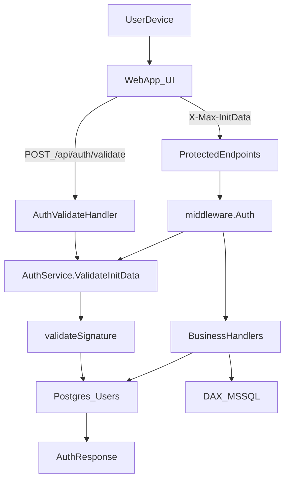

# Поток работы и API (подробно)

Документ описывает, как приложение работает по шагам, какие запросы куда уходят,
что возвращается и зачем нужны ключевые маршруты.

## Блок-схема (верхний уровень)


## Что такое initData и как проходит авторизация
Источник: MAX WebApp SDK. Строка `initData` выглядит как URL-encoded query string:
```
auth_date=...&query_id=...&user=%7B...%7D&hash=...
```

### Проверка подписи (бэкенд)
1) Бэкенд получает строку `initData`.
2) Декодирует URL-строку и парсит параметры.
3) Извлекает `hash`.
4) Строит **data-check string**: сортирует ключи (кроме `hash`) и склеивает `key=value` через `\n`.
5) Вычисляет:
   - `secret = HMAC_SHA256("WebAppData", BOT_TOKEN)`
   - `expected = HMAC_SHA256(secret, data-check string)`
6) Сравнивает `expected` с `hash`.
7) При валидной подписи парсит `user` (JSON) и берет `id`.
8) Находит пользователя в Postgres по `max_user_id`. Если нет — создает запись.

### Где это происходит
- `POST /api/auth/validate` — первичная проверка и выдача флагов пользователя.
- `X-Max-InitData` — используется на всех защищенных запросах (middleware).

## Маршруты API и зачем они нужны

### 1) `POST /api/auth/validate`
**Назначение:** проверка `initData` и выдача флагов для UI.

**Запрос:**
```
{
  "initData": "auth_date=...&query_id=...&user=...&hash=..."
}
```

**Ответ (успех):**
```
{
  "success": true,
  "data": {
    "userId": 123,
    "isAdmin": false,
    "isApproved": false,
    "isBlocked": false,
    "profileComplete": false,
    "firstName": "",
    "lastName": ""
  }
}
```

**Ответ (ошибка):**
```
{ "success": false, "message": "invalid initData" }
```

### 2) `POST /api/users/profile`
**Назначение:** сохраняет ФИО пользователя (firstName/lastName).

**Зачем нужен этот маршрут:**
- Без ФИО пользователь не допускается к поиску партий.
- ФИО показывается администратору для проверки/одобрения.
- По ФИО администратор ищет пользователей в админке.

**Требования:** заголовок `X-Max-InitData`, пользователь не заблокирован.

**Запрос:**
```
{
  "firstName": "Иван",
  "lastName": "Иванов"
}
```

**Ответ (успех):**
```
{ "success": true }
```

**Ответ (ошибка):**
```
{ "success": false, "message": "firstName and lastName required" }
```

### 3) `GET /api/warehouse/batches?code=...`
**Назначение:** поиск партий в DAX/MSSQL.

**Требования:** заголовок `X-Max-InitData`, пользователь **одобрен** и **не заблокирован**.

**Ответ (успех):**
```
{ "success": true, "rows": 2, "data": [ ... ] }
```

**Ответ (ничего не найдено):**
```
{ "success": false, "rows": 0, "data": [], "message": "not found" }
```

**Ответ (ошибка формата кода):**
```
{ "success": false, "message": "invalid code format" }
```

### 4) `GET /api/admin/users?q=...`
**Назначение:** поиск пользователей по ФИО (firstName/lastName).

**Требования:** заголовок `X-Max-InitData`, пользователь админ.

**Важно:** если `q` пустой, бэкенд возвращает пустой список.

**Ответ (успех):**
```
{ "success": true, "data": [ { "id": 1, "firstName": "...", "lastName": "...", "isAdmin": false, ... } ] }
```

### 5) `PATCH /api/admin/users/{id}`
**Назначение:** изменение флагов пользователя.

**Требования:** заголовок `X-Max-InitData`, пользователь админ.

**Запрос (любые поля, минимум одно):**
```
{ "isApproved": true }
{ "isBlocked": false }
{ "isAdmin": true }
```

**Ответ (успех):**
```
{ "success": true }
```

### 6) `GET /api/dev/init-data` (dev-only)
**Назначение:** генерация валидной initData для локального теста без MAX.

**Доступность:** только если включен `ENABLE_INITDATA_MOCK`.

**Пример:**
```
/api/dev/init-data?user_id=1001&first_name=Ivan&last_name=Ivanov&language=ru&front=http://localhost:5173
```

**Ответ:**
```
{
  "success": true,
  "data": {
    "initData": "...",
    "url": "http://localhost:5173/?initData=..."
  }
}
```

### 7) `GET /healthz` и `GET /readyz`
Простые индикаторы здоровья/готовности.

### 8) `GET /metrics`
Prometheus endpoint.

## Примечания по формату ответов
- Все ошибки возвращаются как:
```
{ "success": false, "message": "..." }
```
- Успешные ответы различаются по полям (`data`, `rows` и т.п.) в зависимости от маршрута.
